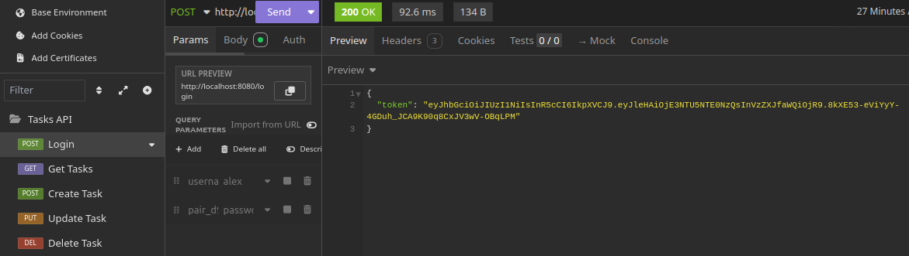
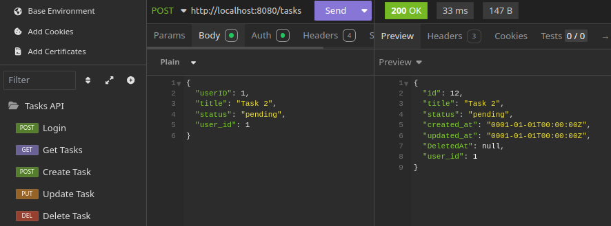
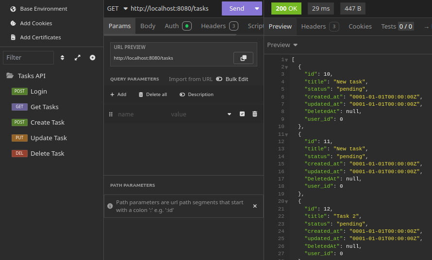
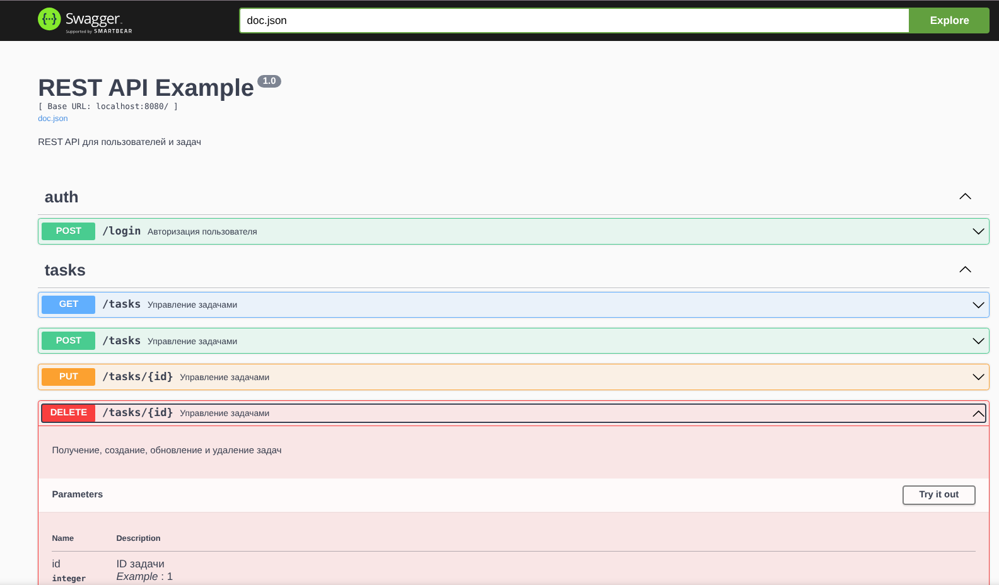

#  REST API для управления задачами (Go)
API для управления задачами. Позволяет авторизоваться, создавать, получать, обновлять и удалять задачи.  
## 📂 Структура проекта
```
├── .github
│   └── workflows
│       └── go.yml
├── cmd
│   ├── main.go
│   └── utils
│       └── config_printer.go
├── configs
│   └── config.yaml
├── docker-compose.yml
├── Dockerfile
├── docs
│   ├── docs.go
│   ├── swagger.json
│   └── swagger.yaml
├── go.mod
├── go.sum
├── Insomnia_2025-08-23.yaml
├── internal
│   ├── auth
│   │   └── jwt.go
│   ├── config
│   │   └── config.go
│   ├── models
│   │   ├── task.go
│   │   └── user.go
│   ├── repositories
│   │   └── user_repo.go
│   ├── seed
│   │   └── seed.go
│   ├── server
│   │   ├── auth_handlers.go
│   │   ├── server.go
│   │   └── server_test.go
│   └── services
│       ├── auth_service.go
│       ├── auth_service_mock.go
│       ├── integration_test
│       │   ├── full_integration_test.go
│       │   └── task_service_integration_test.go
│       ├── task_service.go
│       ├── task_service_mock.go
│       └── unit
│           ├── mock_auth_service_mock.go
│           └── mock_task_service_test.go
├── LICENSE
├── Makefile
├── migrations
│   ├── 002_create_users_table.down.sql
│   ├── 002_create_users_table.up.sql
│   ├── 003_create_tasks_table.down.sql
│   └── 003_create_tasks_table.up.sql
├── monitoring
│   ├── dashboards
│   │   ├── provisioning
│   │   │   └── dashboards
│   │   │       └── dashboard.yml
│   │   └── rest_api_dashboard.json
│   └── prometheus.yml
├── prometheus.yml
├── README.md
├── screenshots
│   ├── create_task_request.png
│   ├── get_tasks_request.png
│   └── login_request.png
└── tests
```

## 🏗 Архитектура проекта REST API для управления задачами

## 📌 Общая концепция

Проект реализует **многослойную архитектуру** для REST API, позволяющего:
- авторизоваться,  
- создавать, получать, обновлять и удалять задачи.  

Каждый слой отвечает за свою область ответственности, что упрощает поддержку и масштабирование кода.

---

## 🧩 Слои приложения

### 1. **Модели (Model Layer)**
- Описывают основные сущности приложения: **задачи (`Task`)**, **пользователи (`User`)**.  
- 📂 `internal/models/`

---

### 2. **Сервисный слой (Service Layer)**
- Реализует бизнес-логику приложения.  
- Включает методы для работы с задачами и пользователями (CRUD).  
- **Доступ к данным встроен в сервисный слой** — сервисы напрямую работают с PostgreSQL через SQL-запросы.  
- Примеры: `PostgresTaskService`, `PostgresUserService`.  
- 📂 `internal/services/`

---

### 3. **Обработчики HTTP-запросов (Handler Layer / API Layer)**
- Принимают и обрабатывают HTTP-запросы.  
- Делают валидацию данных, авторизацию, вызывают сервисы, формируют ответы.  
- 📂 `internal/server/`

---

### 4. **Конфигурация и утилиты**
- Настройки приложения, подключение к базе, работа с переменными окружения.  
- 📂 `internal/config/`, `configs/`, `cmd/utils/`

---

### 5. **Тесты**
- **Unit-тесты** — проверяют бизнес-логику сервисов (с моками).  
- **Интеграционные тесты** — тестируют весь API, включая работу с реальной базой.  
- 📂 `internal/services/unit/` (unit), `internal/services/integration_test/` (integration), `internal/seed/` (тестовые данные)

---

### 6. **Миграции**
- SQL-скрипты для управления структурой базы данных.  
- 📂 `migrations/`

---

### 7. **Документация**
- Swagger/OpenAPI — описание API.  
- `README.md` — примеры запуска и использования.  
- 📂 `docs/`, `README.md`

---

### 8. **Мониторинг**
- Интеграция с **Prometheus** и **Grafana** для метрик и визуализации.  
- 📂 `monitoring/`, `prometheus.yml`

---

## 🔄 Взаимодействие слоёв
```
HTTP-запрос
↓
[Handler Layer]
↓
[Service Layer (бизнес-логика + доступ к данным)]
↓
[База данных (PostgreSQL)]
 ```

## Запуск сервера приложения

Для запуска сервера используйте команду:

```bash
go run ./cmd/main.go
```
Пример вывода в консоли:
```
2025/08/23 14:15:03 Пользователи загружены
Starting application...
```
## API
### Login
Метод: `POST /login`
Описание: Авторизация пользователя для получения JWT-токена.

Тело запроса:
```json
{
  "username": "alex",
  "password": "password123"
}
```
Пример запроса (Insomnia): 

Пример ответа:

```json
{
  "token": "eyJhbGciOiJIUzI1NiIsInR5cCI6IkpXVCJ9..."
}
```
### Create Task
Метод: `POST /tasks`
Описание: Создание новой задачи. Требует токен авторизации.

Тело запроса:

```json
{
  "userID": 1,
  "title": "Новая задача",
  "status": "pending"
}
```
Пример запроса (Insomnia): 

Пример ответа:

```json
{
  "id": 1,
  "userID": 1,
  "title": "Новая задача",
  "status": "pending"
}
```
### Get Tasks
Метод: `GET /tasks`
Описание: Получение списка всех задач пользователя. Требует токен авторизации.

Пример запроса (Insomnia): 

Пример ответа:

```json
[
  {
    "id": 1,
    "userID": 1,
    "title": "Новая задача",
    "status": "pending"
  }
]
```
## ⚙️ Установка и запуск
Создать .env:
```
cp .env.example .env
```
Пример .env:
```INI
DB_HOST=localhost
DB_PORT=5432
DB_USER=alex
DB_PASSWORD=secret
DB_NAME=restapi
```
⚠️ Важно: .env не коммитится, хранит локальные секреты.

Установить зависимости Go:

```bash
go mod tidy
```
Makefile — основные команды:

```bash
make run	Запуск приложения с миграциями
make migrate-up	Применить новые миграции
make migrate-down	Откатить последнюю миграцию
make migrate-force VERSION=2	Принудительно установить версию миграций
make migrate-reset	Полный сброс базы и повторное применение всех миграций
```
Пример работы
```bash
# Применить все миграции
make migrate-up
```
Откатить последнюю миграцию
```bash
make migrate-down
```
Принудительно синхронизировать версию миграций
```bash
make migrate-force VERSION=1
```
Сбросить базу и заново применить миграции
```bash
make migrate-reset
```
## Работа с API через curl
### Login

```bash
curl -X POST http://localhost:8080/login \
  -H "Content-Type: application/json" \
  -d '{"username":"alex","password":"password123"}'
```
Ответ:
```json
{
  "token": "eyJhbGciOiJIUzI1NiIsInR..."
}
```
### Get Tasks

```bash
curl http://localhost:8080/tasks \
  -H "Authorization: Bearer <ваш_JWT_токен>"
```
Ответ:

```json
[
  {"id":1,"title":"Test task","status":"todo"},
  {"id":2,"title":"Test task","status":"todo"}
]
```
##  Тесты
Запуск всех тестов 
```bash
go test ./... -v -count=1
```
Запуск unit-теста хандлеров
```bash
go test ./internal/server -v -count=1
```
Запуск конкретного unit-теста
```bash
go test ./internal/server -v -run TestTasksHandler
```
Запуск всех интеграционных тестов
```bash
go test ./internal/services/integration_test -v -count=1
```
Запуск конкретного интеграционного теста
```bash
go test ./internal/services/integration_test -v -run TestFullIntegration
```
Просмотр доступных тестов
```bash
go test ./internal/services/integration_test -list .
```
Unit-тесты
```bash
go test ./internal/services/unit -v -count=1
```

## 📊 Grafana и Prometheus
```bash
docker compose up -d

Grafana: http://localhost:3000
Логин: admin
пароль: admin

Prometheus: http://localhost:9090
```

## Документация Swagger

API документировано с помощью Swagger (Swaggo).  
После запуска сервера Swagger UI будет доступен по ссылке:

[http://localhost:8080/swagger/index.html](http://localhost:8080/swagger/index.html)

Здесь вы можете просматривать все эндпоинты, модели данных и тестировать API прямо из браузера.
Для запуска сервера используйте команду:

```bash
go run ./cmd/main.go
```


💡 Основные навыки, продемонстрированные в проекте
- Реализация многослойной архитектуры REST API на Go.
- Unit- и интеграционное тестирование с моками.
- Обработка ошибок и стандартизация JSON-ответов.
- Структурирование кода для масштабируемых приложений.
- Подготовка инструкций для локального запуска и тестирования.